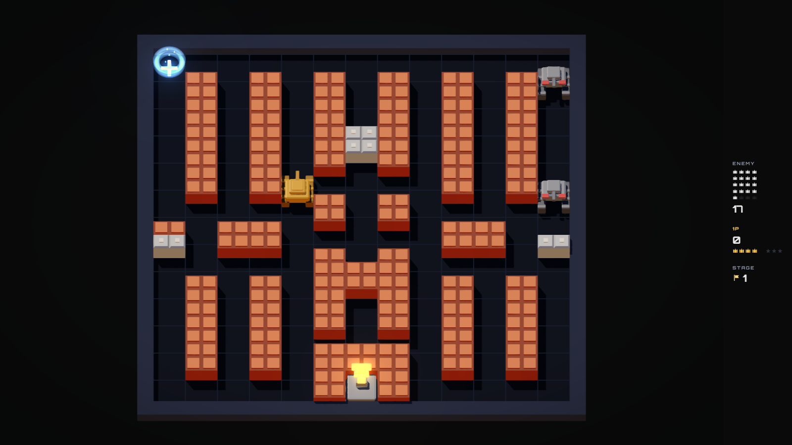

# Battle City Remake

A faithful remake of Namco's **Battle City** (NES, 1985) for the browser. The rules are the NES's, read out of the game's own code; the look is a 2.5D reinterpretation built entirely from code — no image, audio or font file is ever downloaded.

**▶ Play it:** <https://tarikdsm.github.io/Battle_City_Clone/>



**Version 1.0.0.** Read [the release notes](docs/08-release-notes.md) before you judge it — they say plainly what is verified, what is emulated, and what has never been tested on real hardware.

---

## Play

Defend the eagle at the bottom of the field. Twenty enemy tanks come at it, four on the board at a time (six in two-player). Lose the eagle, or lose all your lives, and the run is over. Shoot bricks to open lanes, shoot the flashing tank to make it drop a power-up, and do not shoot your own base.

### Controls

| Action | Player 1 | Player 2 | Gamepad | Touch |
|---|---|---|---|---|
| Move | `W` `A` `S` `D` | Arrow keys | D-pad / left stick | Virtual stick, left |
| Fire | `J` (hold to autofire) | Numpad `0` / Right `Ctrl` | A / Cross | Fire button, right |
| Pause | `Esc` or `P` | `Esc` or `P` | Start | Pause icon |
| Menus | Arrows + `Enter`, `Esc` to go back | | D-pad + A / B | Tap |

Movement is four-directional and latches to the dominant axis — there are no diagonals, exactly as on the NES. Every key is remappable in Settings, per player. Two-player is chosen on the main menu's **Players** row.

### Power-ups

| | |
|---|---|
| **Star** | One tier up. Tier 1 fires faster, tier 2 keeps two shots in the air, tier 3 breaks steel. |
| **Helmet** | Ten seconds of shield. |
| **Clock** | Every enemy freezes for ten seconds. |
| **Shovel** | Your base's brick ring turns to steel — until it blinks, which is your warning. |
| **Grenade** | Every enemy on the field, gone. No points for them. |
| **Tank** | An extra life. |

Star and grenade come up twice as often as the rest. That is the NES's own weighting, not a design choice — see below.

---

## What is in it

- **The 35 original stages**, decoded from the Battle City (J) ROM's own stage table rather than redrawn from screenshots.
- **1P and 2P local co-op** — separate scores and lives, one shared enemy pool.
- **A map editor**: terrain painting, mirror modes, enemy-wave editing, instant test-play, local saving, and share codes you can paste to a friend.
- **A synthesized soundtrack** whose layers come in as a stage heats up, and every sound effect generated from oscillators and noise at run time.
- **An installable, offline-capable PWA.**
- Keyboard, gamepad and touch; reduced-motion and high-contrast modes; local high scores.

A twelve-stage authored "Neo" campaign ships as data but is **not reachable from the menu in 1.0** — see the release notes.

---

## Fidelity

The simulation is held to a written rule set ([fidelity spec](docs/01-fidelity-spec.md)) with **26 parity invariants**, each an automated test, plus three golden replays: the same seed and the same input log must produce the same state hash.

The eighteen constants that used to be estimates — movement speeds, effect durations, the spawn cadence, the power-up table — were closed in 1.0 by reading the **6502 of a public Battle City (J) disassembly**, not by measuring an emulator. Fifteen are now sourced to a specific address; three were recovered and deliberately not adopted, each with its reason written down. [Fidelity spec §16](docs/01-fidelity-spec.md) has the whole table.

---

## Build it

Node 20+ and npm.

```sh
npm install
npm run dev          # http://localhost:5173
npm run build        # → dist/
npm run preview      # serve the built bundle
```

Checks:

```sh
npm run check        # typecheck + eslint + prettier + the unit suite
npx playwright test  # the end-to-end suite, through the real UI
```

Regenerating the content and the measurements. Each writes a committed artifact, so a re-run is a diff rather than a claim:

```sh
npm run levels:transcribe   # the 35 stages, from the pinned ROM disassembly
npm run replays:record      # the three golden replays
npm run capture:play        # frame budgets, measured in the real play loop
npm run calibrate:lighting  # the lighting probes art §6 is defined on
```

---

## How it is built

Four layers, one direction of dependency.

**`src/core`** is the simulation: a fixed 60 Hz tick, a seeded RNG, no DOM, no timers, no three.js. It is plain TypeScript that could run in a terminal, which is the whole reason the parity tests and the golden replays can exist. **`src/render`** reads that state and never writes to it — instanced geometry, a lighting rig calibrated against measured probe values, and a post chain that picks the finished frame up out of the drawing buffer so the authored palette survives tone mapping unchanged. **`src/audio`** is a peer of the renderer rather than a client of it: same event stream, same read-only contract, every voice synthesized. **`src/app`** and **`src/ui`** own the screens, the loop that turns wall-clock time into whole ticks, and the storage. The editor is a lazily-imported chunk that a player who never opens it never downloads.

One runtime dependency: three.js.

---

## Documentation

| Doc | Content |
|---|---|
| [00-game-design.md](docs/00-game-design.md) | Vision, modes, screens, controls, accessibility |
| [01-fidelity-spec.md](docs/01-fidelity-spec.md) | Exact NES rules — the source of truth, and §16's calibration table |
| [02-architecture.md](docs/02-architecture.md) | Stack, module boundaries, budgets, testing strategy |
| [03-art-direction.md](docs/03-art-direction.md) | Camera, palette, models, lighting, VFX, readability rules |
| [04-audio-direction.md](docs/04-audio-direction.md) | Synth engine, adaptive music, SFX recipes |
| [05-content-levels.md](docs/05-content-levels.md) | Level format, the transcription protocol, the Neo campaign |
| [08-release-notes.md](docs/08-release-notes.md) | **What is verified, what is emulated, what is untested** |

---

## Credits

Original game: **Battle City**, Namco, 1985. Original music: Junko Ozawa.

An independent remake. It contains no ROM data, no ripped graphics and no ripped audio — stage layouts are decoded at build time from a public disassembly's data tables by a committed script, and everything you see and hear is generated from code.

Built docs-first with orchestrated multi-agent execution: an orchestrator owns the specs, task breakdown and review; executor agents implement each task under TDD against the fidelity spec's parity checklist.
